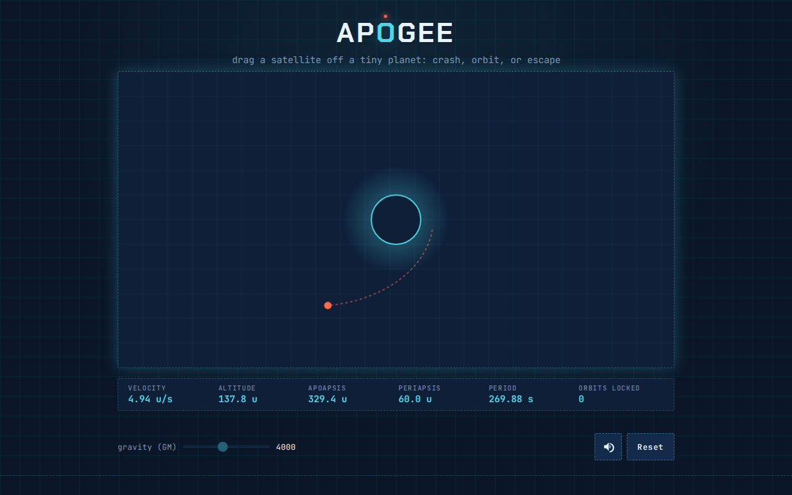

# Apogee

**▶ Live demo — [apps.charliekrug.com/escape-velocity](https://apps.charliekrug.com/escape-velocity/)**

An orbital mechanics simulator you play in one drag. Pull a satellite off a tiny planet, let
go, and watch real two-body gravity decide what happens next: it arcs back and crashes in a
burst of debris, snaps into a stable glowing orbit, or breaks past escape velocity and flies
off the screen.

[](https://github.com/ctkrug/escape-velocity/actions/workflows/ci.yml)
[](LICENSE)



## Why it exists

Most gravity toys on the web are one of two things: a canned animation that just loops, or a
full N-body sandbox you have to learn before anything happens. Apogee is neither. One planet,
one satellite, one drag. The trajectory you see is integrated frame by frame from real
inverse-square gravity, so every launch is an actual orbital-mechanics outcome rather than a
scripted one. No login, no install, no tutorial.

## The moment

Click-drag away from the planet and release. Where the drag vector lands sets the launch
velocity, and the physics takes it from there:

- **Crash:** too slow, and the ellipse dips into the planet. The satellite arcs back and
  scatters into debris.
- **Orbit:** hit the stable range and it closes into a repeating loop. Hold it for two full
  periods and the orbit locks, with a glowing confirmation ring and a running orbit count.
- **Escape:** pull past the local escape velocity and it leaves on a hyperbolic path, clearing
  the boundary and flying off for good.

## What's inside

- **Real two-body gravity**, integrated with semi-implicit (symplectic) Euler so a stable orbit
  stays stable for as long as you watch it instead of spiraling from numerical drift.
- **Live HUD** reading velocity, altitude, apoapsis, periapsis, orbital period, and a lifetime
  orbit count kept in `localStorage` across reloads.
- **Adjustable gravity** on a slider, locked mid-flight so it never rewrites a trajectory that
  is already in progress.
- **Synthesized sound** for drag-charge, launch, crash, orbit-lock, and clicks, generated in
  code with WebAudio (no audio files), behind a mute toggle that persists.
- **Mouse and touch** launch with a live drag indicator, plus a debris burst, screen shake, and
  an outcome overlay showing the run's stats.
- **Accessible and responsive** at 390 / 768 / 1440 px, keyboard-operable with visible focus,
  and honoring `prefers-reduced-motion`.

## Stack

Vanilla JavaScript (ES modules) and the Canvas 2D API. No framework, no bundler, no build step.
The whole thing ships as static files: `index.html`, `src/`, and `styles/`. The physics, input,
HUD, particle, storage, and audio modules are covered by [Vitest](https://vitest.dev) unit tests
plus [fast-check](https://github.com/dubzzz/fast-check) property tests.

## Run it locally

```bash
npm install
npm run dev             # serve the static site (defaults to http://localhost:8000)
```

Then open the served URL and drag from the planet. There is no build step; the source runs
as-is.

## Test it

```bash
npm test                # full unit + property suite (physics, input, hud, particles, stats, audio, storage)
npm run test:coverage   # same, with a v8 coverage report
```

## Project docs

- [`docs/VISION.md`](docs/VISION.md): the problem, the audience, and what "done" means
- [`docs/DESIGN.md`](docs/DESIGN.md): visual direction, tokens, and the game-feel plan
- [`docs/ARCHITECTURE.md`](docs/ARCHITECTURE.md): module map, data flow, and how to run and test
- [`docs/BACKLOG.md`](docs/BACKLOG.md): the story breakdown with acceptance criteria

## License

MIT. See [LICENSE](LICENSE).

---

More of Charlie's projects → [apps.charliekrug.com](https://apps.charliekrug.com)
